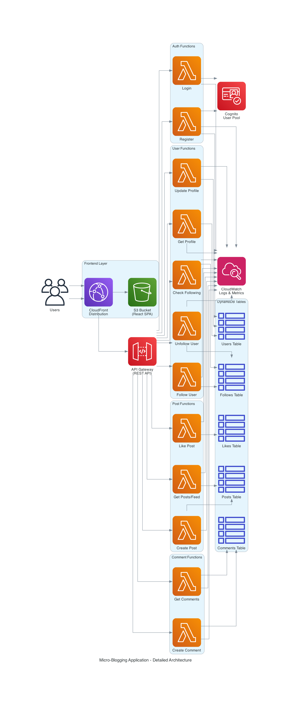

# Serverless Micro-Blogging Application

A modern, serverless social media platform built on AWS that enables users to share short messages, follow others, and engage with content through likes and comments.



## 🚀 Features

- **User Authentication**: Secure sign-up and login with AWS Cognito
- **Post Creation**: Share thoughts with a 280-character limit
- **Social Interactions**: Like posts, follow users, and comment on content
- **Personalized Feed**: View posts from followed users with sorting options
- **User Profiles**: Display user information, follower counts, and post history
- **Real-time Updates**: Dynamic feed with instant content updates

## 🏗️ Architecture

This application follows a serverless architecture pattern:

- **Frontend**: React 18 with TypeScript, hosted on S3 and distributed via CloudFront
- **API Layer**: AWS API Gateway with REST endpoints
- **Compute**: AWS Lambda functions (Node.js 22.x)
- **Database**: DynamoDB with optimized GSIs for efficient queries
- **Authentication**: AWS Cognito User Pools and Identity Pools
- **Monitoring**: CloudWatch for logs and metrics

## 📁 Project Structure

```
/
├── frontend/              # React application
│   ├── src/
│   │   ├── components/   # Reusable UI components
│   │   ├── contexts/     # React contexts (AuthContext)
│   │   ├── pages/        # Route components
│   │   ├── services/     # API client
│   │   └── types/        # TypeScript definitions
│   └── package.json
├── backend/              # Lambda functions
│   └── src/
│       ├── common/       # Shared middleware
│       └── functions/    # Lambda handlers
│           ├── auth/     # Authentication
│           ├── users/    # User management
│           ├── posts/    # Post operations
│           └── comments/ # Comment operations
├── infrastructure/       # AWS CDK stack
│   └── lib/
│       └── app-stack.ts # Infrastructure definition
└── package.json         # Workspace configuration
```

## 🛠️ Technology Stack

### Frontend
- React 18 with TypeScript
- Vite for build tooling
- React Router for navigation
- Playwright for E2E testing
- ESLint for code quality

### Backend
- Node.js 22.x runtime
- AWS SDK v3 (DynamoDB, Cognito)
- Lambda functions (individual handlers)
- CommonJS modules

### Infrastructure
- AWS CDK with TypeScript
- CloudFormation for deployment
- DynamoDB (PAY_PER_REQUEST billing)
- API Gateway (REST API)
- S3 + CloudFront for hosting

## 📋 Prerequisites

- Node.js 22.x or later
- Yarn package manager
- AWS CLI configured with appropriate credentials
- AWS CDK CLI (`npm install -g aws-cdk`)

## 🚀 Getting Started

### 1. Clone the Repository

```bash
git clone https://github.com/Sabiha-git-hub/serverless-microblogging.git
cd serverless-microblogging
```

### 2. Install Dependencies

```bash
yarn install
```

### 3. Deploy Infrastructure

```bash
# Build backend
yarn build:backend

# Deploy CDK stack
yarn workspace infrastructure deploy
```

After deployment, CDK will output the following values:
- API Gateway URL
- Cognito User Pool ID
- Cognito User Pool Client ID
- Cognito Identity Pool ID
- S3 Bucket Name
- CloudFront Distribution ID

### 4. Configure Frontend

Create `frontend/.env` file with the CDK outputs:

```env
VITE_API_URL=<API_GATEWAY_URL>
VITE_USER_POOL_ID=<USER_POOL_ID>
VITE_USER_POOL_CLIENT_ID=<USER_POOL_CLIENT_ID>
VITE_IDENTITY_POOL_ID=<IDENTITY_POOL_ID>
```

### 5. Deploy Frontend

```bash
# Build frontend
yarn build:frontend

# Deploy to S3
yarn deploy:frontend

# Invalidate CloudFront cache
yarn invalidate:cdn
```

Or use the combined deployment command:

```bash
yarn deploy
```

## 💻 Development

### Run Frontend Locally

```bash
yarn start:frontend
```

The app will be available at `http://localhost:5173`

### Build Backend

```bash
yarn build:backend
```

### Run Tests

```bash
# Frontend linting
yarn workspace frontend lint

# E2E tests
yarn workspace frontend test:e2e

# E2E tests with UI
yarn workspace frontend test:e2e:ui
```

## 📊 Database Schema

### DynamoDB Tables

1. **Users**: User profiles and authentication data
   - Primary Key: `userId`
   
2. **Posts**: User posts and content
   - Primary Key: `postId`
   - GSI: `userId-index` for user's posts
   
3. **Likes**: Post likes
   - Primary Key: `likeId`
   - GSI: `postId-index` for post likes
   - GSI: `userId-index` for user likes
   
4. **Comments**: Post comments
   - Primary Key: `commentId`
   - GSI: `postId-index` for post comments
   
5. **Follows**: User follow relationships
   - Primary Key: `followId`
   - GSI: `followerId-index` for following list
   - GSI: `followingId-index` for followers list

## 🔐 Authentication Flow

1. User registers/logs in via Cognito
2. Frontend stores tokens in AuthContext
3. API requests include Authorization header
4. Backend middleware validates token and adds user info to event
5. Lambda functions access user data from event context

## 🌐 API Endpoints

### Authentication
- `POST /auth/register` - Register new user
- `POST /auth/login` - User login

### Users
- `GET /users/profile/:userId` - Get user profile
- `PUT /users/profile` - Update profile
- `POST /users/follow` - Follow user
- `DELETE /users/unfollow` - Unfollow user
- `GET /users/following/:userId/:targetUserId` - Check following status

### Posts
- `POST /posts` - Create post
- `GET /posts` - Get feed
- `POST /posts/like` - Like post

### Comments
- `POST /comments` - Create comment
- `GET /comments/:postId` - Get post comments

## 🎨 Design Philosophy

Modern social media aesthetic with:
- Purple accent colors (#8b5cf6)
- Rounded UI elements
- Mobile-first responsive design
- Clean, minimalist interface
- Focus on user engagement and content discovery

## 📈 Monitoring

All Lambda functions log to CloudWatch with:
- Execution metrics
- Error tracking
- Custom application metrics
- Performance monitoring

## 🤝 Contributing

1. Fork the repository
2. Create a feature branch (`git checkout -b feature/amazing-feature`)
3. Commit your changes (`git commit -m 'Add amazing feature'`)
4. Push to the branch (`git push origin feature/amazing-feature`)
5. Open a Pull Request

## 📝 License

This project is licensed under the MIT License.

## 🙏 Acknowledgments

- Built with AWS serverless technologies
- Inspired by modern social media platforms
- Designed for scalability and cost-efficiency

## 📧 Contact

For questions or support, please open an issue in the GitHub repository.
